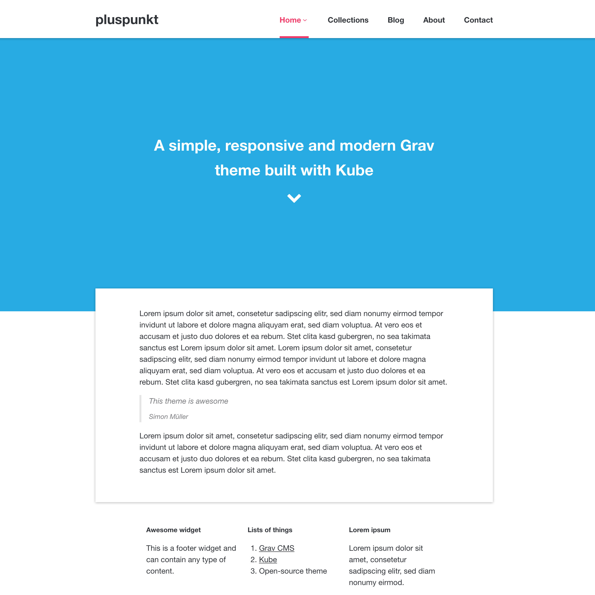

# pluspunkt Grav theme

A simple, responsive and modern Grav theme built with [Kube](https://imperavi.com/kube).



# Installation

Installing the pluspunkt theme can be done in one of two ways. Our GPM (Grav Package Manager) installation method enables you to quickly and easily install the theme with a simple terminal command, while the manual method enables you to do so via a zip file.

## GPM Installation (Preferred)

The simplest way to install this theme is via the [Grav Package Manager (GPM)](http://learn.getgrav.org/advanced/grav-gpm) through your system's Terminal (also called the command line).  From the root of your Grav install type:

    bin/gpm install pluspunkt

This will install the pluspunkt theme into your `/user/themes` directory within Grav. Its files can be found under `/your/site/grav/user/themes/pluspunkt`.

## Manual Installation

To install this theme, just download the zip version of this repository and unzip it under `/your/site/grav/user/themes`. Then, rename the folder to `pluspunkt`. You can find these files either on [GitHub](https://github.com/SimonMueller/grav-theme-pluspunkt) or via [GetGrav.org](http://getgrav.org/downloads/themes).

You should now have all the theme files under

    /your/site/grav/user/themes/pluspunkt

> NOTE: This theme is a modular component for Grav which requires the [Grav](http://github.com/getgrav/grav), [Error](https://github.com/getgrav/grav-plugin-error) and [Problems](https://github.com/getgrav/grav-plugin-problems) plugins. Optional plugins that can be used with this theme are the [Breadcrumbs](https://github.com/getgrav/grav-plugin-breadcrumbs), [Pagination](https://github.com/getgrav/grav-plugin-pagination), [Form](https://github.com/getgrav/grav-plugin-form) and [Maintenance](https://github.com/getgrav/grav-plugin-maintenance) plugins.

# Updating

As development for the pluspunkt theme continues, new versions may become available that add additional features and functionality, improve compatibility with newer Grav releases, and generally provide a better user experience. Updating pluspunkt is easy, and can be done through Grav's GPM system, as well as manually.

## GPM Update (Preferred)

The simplest way to update this theme is via the [Grav Package Manager (GPM)](http://learn.getgrav.org/advanced/grav-gpm). You can do this with this by navigating to the root directory of your Grav install using your system's Terminal (also called command line) and typing the following:

    bin/gpm update pluspunkt

This command will check your Grav install to see if your pluspunkt theme is due for an update. If a newer release is found, you will be asked whether or not you wish to update. To continue, type `y` and hit enter. The theme will automatically update and clear Grav's cache.

## Manual Update

Manually updating pluspunkt is pretty simple. Here is what you will need to do to get this done:

* Delete the `your/site/user/themes/pluspunkt` directory.
* Download the new version of the pluspunkt theme from either [GitHub](https://github.com/SimonMueller/grav-plugin-pluspunkt) or [GetGrav.org](http://getgrav.org/downloads/themes#extras).
* Unzip the zip file in `your/site/user/themes` and rename the resulting folder to `pluspunkt`.
* Clear the Grav cache. The simplest way to do this is by going to the root Grav directory in terminal and typing `bin/grav clear-cache`.

> Note: Any changes you have made to any of the files listed under this directory will also be removed and replaced by the new set. Any files located elsewhere (for example a YAML settings file placed in `user/config/themes`) will remain intact.

## Features

* Lightweight and minimal for optimal performance
* Fully responsive
* SCSS based CSS source files for easy customization
* Multiple page template types
* Footer widgets with markdown content
* General collection pages (e.g. Offers)
* Page intros with fullscreen support
* Set theme wide organization address data
* Pagination, Form, Maintenance and Breadcrumbs plugin ready
* About page with people pages
* Modular contact page

### Supported Page Templates

* Default view template
* Blog view template
* About view template
* Error view template
* General collection view template
* Maintenance view template
* Person view template
* General item view template (e.g. Blog item)
* Modular view templates:
  * Modular contact view template
  * Modular default view template
  * Modular form view template

### General Collections

General collections can have a collection head (the collection page content) and can list the contained items.

```yaml
collection_head:
  enabled: true
  list_items: true
```

> Note: The Blog page is just an alias of a general collection page for compatibility.

### Organization Address

The theme configuration allows you to set theme wide organization address data. This can be used for example in the contact page to generate an address.

```yaml
organization:
  name: example
  phone: +1234567890
  email: example@example.com
  address:
    street: Example Street 1
    city: Example
    zip_code: 1234
    country_code: ch
  geo:
    latitude: 0
    longitude: 0
```

### Footer Widgets

Site wide footer widgets can be added in the theme configuration and can contain arbitrary markdown content.

```yaml
footer:
  widgets:
    -
      title: Awesome widget
      content: 'This is a footer widget and can contain any type of content.'
    -
      title: Lists of things
      content: '1. [Grav CMS](https://getgrav.org)\r\n2. [Kube](https://imperavi.com/kube)\r\n3. Open-source theme'
    -
      title: Lorem ipsum
      content: 'Lorem ipsum dolor sit amet, consetetur sadipscing elitr, sed diam nonumy eirmod.'
```

### Dropdown Menu

You can enable **dropdown menu** support by enabling it in the `pluspunkt.yaml` configuration file. As per usual, copy this file to your `user/config/themes/` folder (create if required) and edit there.

```yaml
dropdown:
  enabled: true
```

This will ensure that sub-pages show up as sub-menus in the navigation.

### Page Intro

You can enable **page intros** by enabling it in the corresponding page frontmatter or in the dedicated tab in the admin panel page editor.

```yaml
intro:
  enabled: true
  fullscreen: false
  text_enabled: true
  text: I am an intro text
```

### Person Page

If you want to show a portrait next to the page content you should set the `portrait` values on the content page. The portrait image can be uploaded as page media and selected afterwards. Additionally you can set the contact email address.

```yaml
person:
  portrait:
    url: person.png
    alt: John Doe

  contact:
    email: john.doe@example.com
```

### About Page

The about page has a collection head and lists the person pages with address and portrait.

### Item Page

The item page can show a resource download (e.g. link to pdf). The resource can be uploaded as page media and selected afterwards.

```yaml
download:
  url: example.json
  alt: Download Resource
```

### Modular Contact Page

The modular contact page includes an address generated from the theme's blueprint (`organization` fields) and includes it after the page content.

# Setup

If you want to set pluspunkt as the default theme, you can do so by following these steps:

* Navigate to `/your/site/grav/user/config`.
* Open the **system.yaml** file.
* Change the `theme:` setting to `theme: pluspunkt`.
* Save your changes.
* Clear the Grav cache. The simplest way to do this is by going to the root Grav directory in Terminal and typing `bin/grav clear-cache`.

Once this is done, you should be able to see the new theme on the frontend. Keep in mind any customizations made to the previous theme will not be reflected as all of the theme and templating information is now being pulled from the **pluspunkt** folder.

# License

Copyright (C) 2017 Simon Müller

This program is free software: you can redistribute it and/or modify
it under the terms of the GNU General Public License as published by
the Free Software Foundation, either version 3 of the License, or
(at your option) any later version.

This program is distributed in the hope that it will be useful,
but WITHOUT ANY WARRANTY; without even the implied warranty of
MERCHANTABILITY or FITNESS FOR A PARTICULAR PURPOSE.  See the
GNU General Public License for more details.

You should have received a copy of the GNU General Public License
along with this program.  If not, see <http://www.gnu.org/licenses/>.
